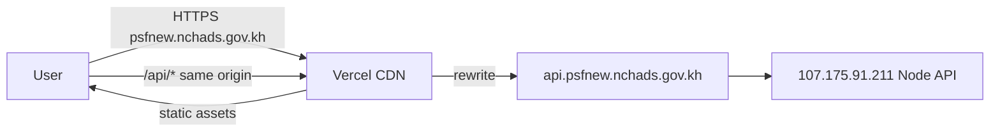

# Frontend on Vercel + custom domain (CDN)

Host the React SPA on **Vercel’s global CDN** while keeping **`https://psfnew.nchads.gov.kh`** as the public URL. API traffic stays on your VPS (via `api.psfnew.nchads.gov.kh` or the rewrite target in `frontend/vercel.json`).

## Architecture



- **Browser** sees one origin (`psfnew.nchads.gov.kh`) for UI and `/api` — no PHP gateway, no mixed-content issues.
- **Redis** stays on the VPS backend only; the frontend never talks to Redis.

## 1. Create the Vercel project

1. Import this repo in [Vercel](https://vercel.com/new).
2. Set **Root Directory** to `frontend`.
3. Framework: **Vite** (or auto-detect from `vercel.json`).
4. **Environment variables** (Production):

   | Name | Value |
   |------|--------|
   | `VITE_USE_PHP_GATEWAY` | `false` |

   Do **not** set `VITE_API_BASE` unless you want the browser to call the API host directly (CORS required).

5. Deploy once on the default `*.vercel.app` URL and confirm login works.

## 2. API backend target

`frontend/vercel.json` rewrites:

```text
/api/*  →  https://api.psfnew.nchads.gov.kh/api/*
```

If that hostname is not live yet, edit the rewrite to your working API URL, e.g.:

```text
http://107.175.91.211/api/$1
```

Then redeploy. Prefer HTTPS on a dedicated API subdomain (nginx + Let’s Encrypt on the VPS).

## 3. Custom domain (CDN to your domain)

1. Vercel project → **Settings → Domains** → Add `psfnew.nchads.gov.kh`.
2. At your DNS provider (NCHADS / HostPapa DNS panel), add what Vercel shows, typically:

   | Type | Name | Value |
   |------|------|--------|
   | CNAME | `psfnew` | `cname.vercel-dns.com` |

   Or use Vercel nameservers if you delegate the whole zone.

3. Wait for SSL (automatic on Vercel).
4. Remove or stop using the old **HostPapa** document root for `psfnew` so only Vercel serves that hostname (otherwise DNS may still hit HostPapa).

## 4. Backend CORS

After the domain points to Vercel, ensure `backend/.env` on the VPS includes:

```env
CLIENT_URL=https://psfnew.nchads.gov.kh
```

`backend/src/app.js` already allows `https://psfnew.nchads.gov.kh` and `*.vercel.app` preview URLs.

## 5. CLI deploy (optional)

```bash
cd frontend
npm ci
npm run build
npx vercel --prod
```

Or from repo root: `./deploy.sh vercel` (requires Vercel CLI linked to the project).

## 6. HostPapa vs Vercel

| | HostPapa | Vercel + custom domain |
|--|----------|-------------------------|
| Static hosting | cPanel upload | Global CDN |
| API | `psf-api.php` gateway | `/api` rewrite → VPS |
| Build flag | `VITE_USE_PHP_GATEWAY=true` | `false` (default) |
| WebSocket reporting | polling only | polling fallback (Vercel rewrite may not proxy WS) |

Questionnaire public URLs can stay on HostPapa if you use a separate path/host; admin app on Vercel is the usual split.

## 7. Verify

- `https://psfnew.nchads.gov.kh/` loads the app.
- Network tab: requests go to `https://psfnew.nchads.gov.kh/api/...` (not `psf-api.php`).
- Login works; reporting dashboard shows `X-Cache: HIT` after refresh when Redis is enabled on VPS.
